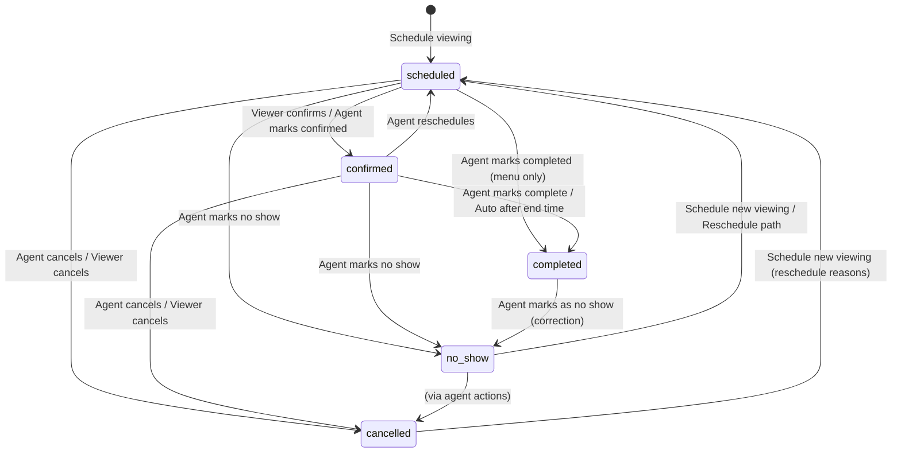

# Viewings Prototype — States, Flows & Behaviour

This document describes the interactive viewings prototype built for **Homey Agency workflows** on property case **PU-0001** (12 Duarte Close, Harrow HA1 4GW).

| File | Role |
|------|------|
| **`agent-view-v5.html`** | **Current prototype** — agent viewings CRM, client (vendor) dashboard, viewer (applicant) inbox, all flows below |
| `agent-view-v4.html` | Earlier iteration — agent-only dock, simpler status CTAs, suitability rating on completed viewings |
| `design-system/homeywebfoundation.css` | Shared design tokens and components (badges, modals, autosave status, etc.) |

Open `agent-view-v5.html` in a browser to walk through every flow.

**Prototype controls:** click the small **red button** in the header (next to the avatar) to open **Prototype controls** — simulated date/time and email settings. Click outside or press Escape to close.

---

## 1. Perspectives

Three switchable perspectives (header segmented control: **Agent** | **Client** | **Viewer**):

| Perspective | User | What they see |
|-------------|------|----------------|
| **Agent** | John Doe (Towers Wills) | Case panel, viewings list + detail dock, all modals |
| **Client** | Mr Hussain Somani (vendor/seller) | Seller dashboard + **Viewing and Feedback** workflow (list + read-only detail dock) |
| **Viewer** | Applicant (e.g. Lisa Okinovo) | Simulated confirmation email inbox with confirm / reschedule / cancel actions |

**Important naming:**
- **Viewer** = applicant who books and attends the viewing
- **Client** = property seller (vendor) who receives updates
- **Agent** = estate agent managing viewings on the case

All three perspectives read from the same in-memory `viewings` and `leads` data.

---

## 2. Agent UI layout

### 2.1 Viewings page

- **Title row:** `Viewings` with **Update Vendor** (secondary) and **Create Viewing** (primary)
- **Left column:** search, time filters, advanced filter menu, scrollable viewing cards
- **Right column:** detail dock (~413px); **empty on first load** (`selectedId = null`) — ghost cards + “Nothing selected yet”
- Selecting a card opens full viewing details in the dock

### 2.2 List filters

**Search:** filters by applicant name (live as you type).

**Time toggles:** `All` | `Today` | `Upcoming` | `Past`
- **All** — grouped sections: Today, Upcoming (preview + load more), Past (preview + load more)
- **Today / Upcoming / Past** — full list for that bucket

**Filter button** — multi-level dropdown:
| Category | Options |
|----------|---------|
| Status | Any + each viewing status |
| By assignee | Any + agents from viewings data |
| By applicant name | Any + viewer names |
| By price proposed | Any / Yes / No |

Active filters appear as **chips** (column name + value); each chip can be cleared. **Clear all** and **Apply** in the filter panel.

### 2.3 Case panel

Left sidebar: vendor contact (Mr Hussain Somani), property address, price, workflow list with **Viewings** active under Agency.

---

## 3. Viewing statuses

A viewing can be in exactly one of five statuses:

| Status | Label in UI | Meaning |
|--------|-------------|---------|
| `scheduled` | Scheduled | Viewing booked; confirmation may or may not have been sent |
| `confirmed` | Confirmed | Applicant (or agent) has confirmed attendance |
| `completed` | Completed | Viewing took place; agent can record applicant assessment |
| `no_show` | No Show | Applicant did not attend; rebook flow applies |
| `cancelled` | Cancelled | Viewing will not happen |

### 3.1 State transition diagram

### 3.2 Lead status (separate from viewing status)

Leads (`leads[]`) have `status: 'active' | 'lost'`.

Marking a lead as **lost** does not delete the viewing record; it sets `viewing.leadLost = true` and stores `lostReason`. The viewing remains in its current status (`no_show` or `cancelled`).

---

## 4. Data model (per viewing)

Each viewing is created via `base()` with these fields:

| Field | Purpose |
|-------|---------|
| `id`, `viewer`, `date`, `time`, `duration` | Identity and schedule (default duration 30 min) |
| `status` | One of five statuses above |
| `type`, `agent`, `accompaniedBy` | e.g. Agent accompanied, Owner accompanied, assignee name |
| `confirmationSent` | Confirmation email sent to applicant |
| `rescheduleRequested` | Viewer requested reschedule (agent sees **Reschedule** as primary CTA) |
| `reminderEnabled` | Data field (reminder UI not shown in v5 dock) |
| `notesInternal` | Agent notes — **team only**, never shared with vendor |
| `summary` | Feedback & notes — **only field shared with vendor** in update emails |
| `interest` | Very interested / Interested / Neutral / Not interested (assessment; not in vendor email) |
| `buyingSituation` | First-time buyer, chain position, cash buyer, etc. (assessment; not in vendor email) |
| `priceProposed`, `proposedPrice`, `offerPrice` | Offer tracking (assessment / client dashboard; not in vendor email) |
| `vendorNote` | Optional note on client dashboard (separate from vendor update email body) |
| `cancelReason` | Why viewing was cancelled |
| `rebook`, `rebookEmailSentAt` | No-show rebook attempt counter (max 3) |
| `leadLost`, `lostReason` | Lead marked lost with reason |
| `activity[]` | Chronological activity log entries |

**Agency agents** (for assignee): John Doe, Sarah Malik, Michael Torres. Logged-in agent: **John Doe**.

---

## 5. Seed data (demo viewings)

Default **Simulated now**: 29 May 2026, 11:00.

| Viewer | Date | Status | Notes |
|--------|------|--------|-------|
| Lisa Okinovo | 29 May | `scheduled` | No confirmation sent — full happy path |
| Mark Jensen | 29 May | `confirmed` | Confirmation sent; viewer confirmed |
| Sofia Romano | 29 May | `completed` | Assessment filled; feedback summary present |
| Derik Alrhtia | 29 May | `no_show` | Rebook attempt 1 of 3; rebook email sent |
| James Parker | 29 May | `cancelled` | “Viewer no longer interested” — Mark as Lost CTA |
| Emma Walsh | 30 May | `scheduled` | Future; confirmation sent |
| Nina Patel | 30 May | `confirmed` | Future |
| Oliver Chen | 1 Jun | `scheduled` | Future |
| Priya Sharma | 2 Jun | `scheduled` | Future |
| Tom Bradley | 27 May | `completed` | Past; feedback summary present |

**Last vendor update** meta: button tooltip shows “sent 3 days ago” until agent sends a new update.

---

## 6. Agent flows — by viewing status

### 6.1 Scheduled

**Dock shows:** Hero (avatar + name), date/time, status, accompanied by, assigned agent, **agent notes** (team only), activity log.

**Footer:**
| Condition | UI |
|-----------|-----|
| Reschedule requested | Primary: **Reschedule** |
| Auto confirmation **off** | Primary: **Send Confirmation Email** / **Resend**; copy below button: *“The confirmation email is the main touchpoint…”* |
| Auto confirmation **on** | Note only: confirmation was sent automatically (no manual button, no touchpoint copy) |

**Auto confirmation** requires **both** prototype toggles: Auto reminders **and** Auto confirmation. When enabled, confirmation sends when viewing is scheduled, when dock opens for a scheduled viewing without confirmation, and when settings change.

**Three-dot menu — Update status:** Mark as Confirmed, Mark as No Show, Cancel Viewing  
**Three-dot menu — Edit viewing:** Reschedule, Edit Applicant, Delete Viewing  
*Hidden:* Mark as Completed, Schedule New Viewing

---

### 6.2 Confirmed

**Dock:** Same info rows as scheduled + agent notes.

**Footer:**
| Condition | UI |
|-----------|-----|
| Reschedule requested | **Reschedule** |
| Default | Hint: *“Marks as complete automatically after the scheduled viewing ends…”* |

**Auto-complete:** When simulated time ≥ viewing end (start + duration) → `completed`, activity logged, toast shown.

**Three-dot menu — Update status:** Mark as Completed, Mark as No Show, Cancel Viewing  
*Hidden:* Mark as Confirmed, Schedule New Viewing

---

### 6.3 Completed

**Dock layout:**
- Compact hero: avatar, name, Completed badge, schedule
- **Agent notes** (team only)
- **Applicant Assessment** with **autosave**:
  - Feedback & Notes (`summary`) — caption: *visible to team and vendor*
  - Interest Level, Buying Situation, Price Proposed + Proposed Price (£)
  - Autosave: Saving… / Saved / error if price toggle on but amount empty
- Activity log (+ View full activity if >2 entries)

**Footer:** **Mark as no show** only (correction for auto-complete or mistaken completion).

**Three-dot menu:** Status actions hidden; Reschedule + Edit Applicant only; Delete hidden.

**Vendor update:** See §7.8 — not limited to completed-only; includes today/past viewings of any status.

---

### 6.4 No Show

**Dock shows:** Rebook attempt X of 3; warning at max attempts.

**Footer:**

| Condition | Primary | Secondary |
|-----------|---------|-----------|
| `rebook < 3` | Send Rebook Email | Schedule New Viewing |
| Rebook email already sent for attempt | Send Rebook Email (disabled) + footnote | Schedule New Viewing |
| `rebook ≥ 3`, not lost | Mark as Lost | Schedule New Viewing |
| `leadLost` | — | — |

**Three-dot menu:** Status actions hidden; Reschedule hidden; Schedule New Viewing, Edit Applicant available.

---

### 6.5 Cancelled

**Dock shows:** Cancellation reason; lost reason if `leadLost`.

**Footer** branches on `cancelReason`:

| Cancel reason | Footer CTA |
|---------------|------------|
| Viewer wants to reschedule / Scheduling conflict | Schedule New Viewing |
| Viewer found another property / Viewer no longer interested | Mark as Lost (if not lost) |
| Other reasons | No footer CTA |

**Three-dot menu:** Status actions and Reschedule hidden; Schedule New Viewing and Edit Applicant available.

---

## 7. Agent modals

### 7.1 Create Viewing (`modal-new-viewing`)

- **Applicant** (required): searchable picker — **+ New Lead** (purple) then lead names; or type to filter / create new lead inline
- Date, time, duration (30 / 45 / 60 min)
- **Accompanied by:** `Owner` | `Agent` (default **Agent**)
  - **Agent** → **Assigned to** dropdown (agency agents; default **John Doe**)
  - **Owner** → Assigned to hidden; viewing saved as Owner accompanied
- **Agent notes** — team only
- **Book Viewing** → `scheduled`; confirmation auto-sent only if both email settings on; toast reflects manual vs auto; selects new viewing in list
- 30-minute conflict warning; second click acknowledges and proceeds

### 7.2 New Lead (`modal-new-lead`)

- Required: first name, last name, email, phone, lead source
- Optional additional fields (expandable)
- Returns to Create Viewing with new lead selected

### 7.3 Reschedule (`modal-reschedule`)

- Date, time, duration, accompanied by, agent, agent notes
- On confirm → `status: scheduled`, `rescheduleRequested` cleared

### 7.4 Cancel Viewing — agent (`modal-cancel`)

Required reason dropdown → `cancelled`, reason stored, activity logged.

### 7.5 Mark as Lost (`modal-mark-lost`)

Required lost-reason dropdown (+ Other free text) → lead `lost`, `viewing.leadLost`, activity logged.

**Entry points:** No show (rebook ≥ 3), cancelled (found another property / no longer interested).

### 7.6 Delete Viewing (`modal-delete`)

Permanent removal; lead contact unaffected.

### 7.7 Update Applicant (`modal-update-applicant`)

Edit lead name, email, phone linked to viewing.

### 7.8 Send Vendor Update (`modal-vendor-update`)

**Split modal** — left: selection; right: email preview.

**Header:** “Last message sent …” (today / N days ago / date / never).

**Left panel:**
- Intro copy: only **feedback summaries** shared; agent notes stay internal
- **Personalise message** (optional textarea) — included in sent email above viewing blocks
- **Select all** + count; checkbox per eligible viewing with status badge, schedule, snippet

**Eligibility:** viewings with `date ≤ simulated today` (today + past only; **not** future). **All statuses** included (completed, no show, cancelled, scheduled today, etc.).

**Right panel — preview only:**
- Homey email component (To, Subject, greeting, personal message if any)
- **Placeholder badge** (e.g. “6 viewings selected”) — *feedback summaries will appear here for the vendor*
- Does **not** render full viewing content in preview

**Send update:**
- Builds full vendor email with per-viewing blocks
- **Only `summary` (feedback)** shared for completed viewings with feedback
- No shows / cancelled / pending: status line only (*no feedback to share*); **no** agent notes, interest, buying situation, or internal fields
- Email uses Homey template (agency footer, View feedback CTA, Powered by Homey)
- Vendor update is stored in `lastVendorUpdate` (agent modal only); **not** shown on the client dashboard in v5 — vendor sees viewing data via the Viewing and Feedback workflow instead

---

## 8. Viewer (applicant) flows

**Access:** Viewer perspective + persona dropdown.

**Inbox visibility:** Active invitation when `confirmationSent === true` and `status` is `scheduled` or `confirmed`. Otherwise empty state.

### 8.1 Confirmation email actions

| Action | Behaviour |
|--------|-----------|
| **Confirm attendance** | When `scheduled` → `confirmed`; clears reschedule flag |
| **Request reschedule** | Sets `rescheduleRequested`; agent primary → **Reschedule** |
| **Cancel viewing** | Opens modal |

### 8.2 Viewer cancel modal

**Required:** Note for your agent → `cancelled`, `cancelReason` = note, activity logged.

---

## 9. Client (vendor) dashboard — Viewing and Feedback

**Property:** 12 Duarte Close, Harrow HA1 4GW  
**User:** Mr Hussain Somani (seller / vendor)  
**Access:** Header perspective switch → **Client**

The client experience has two screens: a **task dashboard** (property overview + workflow tasks) and the **Viewing and Feedback** workflow (full viewing management UI). All client data is projected from the same in-memory `viewings[]` array the agent uses, via a vendor-safe `toClientViewing()` mapper.

---

### 9.1 Seller dashboard (home)

#### Layout

| Area | Content |
|------|---------|
| **Welcome** | “Hello {first name}” + subheading |
| **Property card** | Address, tags (Sale, Leasehold, guide price), ref PU-0001, agent Towers Wills, illustration |
| **Alert banner** | Prompts vendor to open **Viewing and Feedback** when upcoming viewings exist |
| **Pending tasks** | Workflow task cards (only **Viewing and Feedback** is interactive) |
| **Case progress** | Brochure → Contract → Seller Enquiry Form → Viewing and Feedback → Offer selected → Memorandum of sale |

#### Workflow tasks (`CLIENT_WORKFLOWS`)

| Task | Status | Interactive |
|------|--------|-------------|
| Brochure | Completed | No |
| Contract | Completed | No |
| Seller Enquiry Form | Completed | No |
| **Viewing and Feedback** | In progress | **Yes** — opens viewing workflow |

**Task list tabs:** `Pending tasks` | `Completed` (with count badge).

#### Case progress logic

- Brochure, Contract, Seller Enquiry Form → always shown as **done**
- **Viewing and Feedback** → **active** while no offer preference expressed
- When vendor **expresses an offer preference** (see §9.8), progress advances: Viewing and Feedback marked done, **Offer selected** becomes active

#### Entry into viewings workflow

1. Client perspective → dashboard  
2. Click **Viewing and Feedback** task card  
3. Full-screen workflow replaces dashboard (`clientScreen = 'viewings'`)  
4. **Back to tasks** returns to dashboard and clears any open detail selection

---

### 9.2 Viewing and Feedback — page layout

Mirrors the **agent viewings page** pattern: list column + detail dock, but **read-only** for the vendor.

| Region | Behaviour |
|--------|-----------|
| **Page chrome** | Back link, title “Viewing and Feedback” |
| **Content width** | Centered column matching agent workflow width: `max-width: calc(100vw − 276px)` (equivalent to viewport minus icon rail + case panel) |
| **Controls** | Stacked **vertically** (see §9.3) |
| **Main area** | Scrollable viewing **list** (left) + **detail dock** (right on large screens) |

The workflow fills the viewport height; only the list column and dock body scroll internally (dashboard scroll is disabled while this screen is open).

---

### 9.3 Search and filters (vertical stack)

Controls appear in this order, top to bottom:

1. **Search** — full-width field with clear button; filters by applicant **first name** or date string (live as you type)
2. **Time filter** — toggle row: `All` | `Upcoming` | `Past` | `Offers (n)`  
   - `Offers` label includes count of viewings with a recorded offer  
3. **Date from** — date input, **only visible when `Past` is selected**; filters history to viewings on or after that date

There is no separate Offers tab or page — offers are a **filter** on the same list + dock experience.

---

### 9.4 List behaviour by time filter

| Filter | Included statuses | List grouping | Sort order |
|--------|-------------------|---------------|------------|
| **All** | Every viewing | **Today** section; **Upcoming** preview (3 cards + Load more → switches to Upcoming); **Past** preview (3 cards + Load more → switches to Past) | Within buckets: by date/time |
| **Upcoming** | `scheduled`, `confirmed` | Date groups (e.g. “Fri 30 May”) | Ascending by date |
| **Past** | `completed`, `cancelled`, `no_show` | Meta groups: **Viewings held** then **Did not take place**, each with date sub-groups | Descending by date |
| **Offers** | Viewings where `offerPrice != null` and not `cancelled` | Flat list (no date buckets) | **Highest offer first** |

**Empty states:** contextual copy per filter (e.g. Offers: “Offer prices appear here once your agent records them after a viewing”).

**Default selection:** first card in the filtered list is auto-selected when the filter changes (unless current selection remains in the list).

---

### 9.5 Viewing cards (list)

Uses the same card component as the agent list (**Figma 4172:22372**), with vendor-safe labels:

| Card element | Source |
|--------------|--------|
| **Name** | Applicant **first name only** (`viewerFirstName`) |
| **Time** | Relative schedule label (e.g. “Today, 12:30pm - 1:30pm”) |
| **Status badge** | Same five statuses as agent (Scheduled, Confirmed, Completed, No Show, Cancelled) |
| **Offer badge** | Shown when `offerPrice` set on completed viewing — see §9.6 |
| **Footer** | Completed: feedback summary text, or *“No Feedback Recorded”* (red italic) if empty |

Clicking a card selects it (purple border) and populates the detail dock.

---

### 9.6 Offer badges on cards

Same logic as agent list (`getOfferBadgeVariant`):

| Variant | Colour | When |
|---------|--------|------|
| **Information** (grey) | No feedback summary on completed viewing | e.g. Tom £295k |
| **Pending** (blue) | Feedback recorded, not the highest offer | e.g. Amy £300k |
| **Success** (green) | Feedback recorded **and** highest offer on the case | e.g. Sofia £325k |

**Seed offers (demo):** Sofia £325k (green), Amy £300k (blue), Tom £295k (grey, no feedback).

---

### 9.7 Detail dock (read-only)

Read-only mirror of the agent detail dock (**Figma 4144:19379**). **No** editable inputs, **no** three-dot menu, **no** autosave, **no** footer CTAs.

#### Header

- Title: **Viewing Details** (or **Activity Log** in full-activity mode)
- **Close (×)** on overlay breakpoints (see §9.9)
- **Back** when viewing full activity log

#### Body sections (when a viewing is selected)

| Section | Content |
|---------|---------|
| **Hero** | Avatar (initials), first name, schedule, status badge |
| **Logistics** | Accompanied by, assigned agent (with avatar) |
| **Note from your agent** | `vendorNote` when present — separate from internal agent notes |
| **No show** | Rebook attempt X of 3 |
| **Cancelled** | Cancellation reason |
| **Applicant Assessment** | Read-only fields: Feedback & Notes, Interest Level, Buying Situation, Proposed Price |
| **Offer recorded** | Offer amount (£), **Express preference** button or “★ Your preference” badge |
| **Activity log** | Last 2 entries + **View Full Activity** |

Assessment section appears for `completed` viewings or when any assessment data exists (`summary`, `interest`, `buyingSituation`, `priceProposed`).

#### Empty dock (large desktop only)

When nothing is selected on wide screens: ghost-card illustration + *“Nothing selected yet — Pick a viewing from the list”*.

On overlay breakpoints, the dock is **hidden until** a viewing is selected (no empty ghost in the drawer).

---

### 9.8 Offer preference flow

| Step | Behaviour |
|------|-----------|
| 1 | Vendor opens a viewing with `offerPrice` in the detail dock (any filter, or **Offers** filter) |
| 2 | Reviews full context: feedback, interest, buying situation, proposed price, offer amount |
| 3 | Clicks **Express preference** in the **Offer recorded** section |
| 4 | Preference saved to `localStorage` (`CLIENT_PREF_KEY` = `homey-vf-pref-offer-PU-0001`) |
| 5 | Dock updates to **★ Your preference**; case progress advances toward **Offer selected** |
| 6 | On **Offers** filter, a yellow **preference banner** appears at top of workspace |

Preference is **per property case** in the prototype (single localStorage key). Only one preferred offer at a time; expressing a new preference overwrites the previous.

---

### 9.9 Responsive layout and detail dock modes

| Breakpoint | Layout |
|------------|--------|
| **> 1100px** | List + dock **side by side** (dock fixed 413px). Empty dock visible when no selection. |
| **≤ 1100px** | List **full width**. Selecting a card opens dock as a **right-side drawer** (~420px) with **dimmed backdrop** blocking background interaction. Close via ×, backdrop tap, or **Escape**. Body scroll locked. |
| **≤ 640px** | Drawer becomes **full-screen** modal. Time-filter buttons wrap 2-per-row. Tighter page padding. |

**Escape key behaviour:** closes activity full-view first, then closes the detail dock.

**Resize:** crossing the 1100px breakpoint re-syncs overlay vs inline dock state.

---

### 9.10 Privacy and data boundaries

Client viewings are built by `toClientViewing(v)` — a **vendor-safe projection** from the viewing record only. **Never** reads from the `leads[]` array.

#### Shown to vendor

| Field | Notes |
|-------|-------|
| Applicant **first name** | Not full name |
| Schedule, status, accompanied by, agent | Logistics |
| `summary`, `interest`, `buyingSituation`, `proposedPrice`, `priceProposed` | From agent assessment |
| `offerPrice` | Recorded offer |
| `vendorNote` | Optional note for vendor |
| `cancelReason`, rebook count | On cancelled / no-show |
| `activity[]` | Sanitised activity log entries |

#### Never shown to vendor

| Field | Notes |
|-------|-------|
| Applicant email, phone, full name | Lead PII |
| Lead source, buyer profile fields | CRM data |
| `notesInternal` | Agent-only notes |
| Edit controls, status menu, delete/reschedule | Agent actions |

#### Agent vendor email vs client dashboard

- Agent **Send Vendor Update** email shares **feedback summaries only** for eligible viewings (see §7.8)  
- Client dashboard shows **richer assessment data** (interest, buying situation, proposed price) in the read-only dock — sourced from what the agent recorded on the viewing, not from lead records  
- Sent vendor email HTML is **not** rendered on the client dashboard in v5

---

### 9.11 Live sync with agent perspective

When the agent creates viewings, updates assessment, changes status, or sends vendor updates, switching to (or refreshing) **Client** perspective reflects changes immediately:

- `renderClientDashboard()` re-renders the list and dock when the client is already in the viewings workflow  
- Offer badge colours and counts update when agent edits `summary` or `offerPrice`  
- New viewings appear under the appropriate time filter

---

### 9.12 Client viewing flows — step by step

#### Flow A — Review all viewings

1. **Client** → open **Viewing and Feedback**  
2. Default filter **All** — scan Today / Upcoming / Past sections  
3. Click a card → read assessment and activity in dock  
4. Use **Load more** on Upcoming or Past to switch filters

#### Flow B — Check upcoming schedule

1. Filter **Upcoming**  
2. Search by applicant name if needed  
3. Select viewing → confirm date, time, accompanied by, agent

#### Flow C — Review past viewings and feedback

1. Filter **Past**  
2. Optional: set **Date from** to narrow history  
3. Browse **Viewings held** vs **Did not take place**  
4. Select completed viewing → read feedback summary and assessment fields

#### Flow D — Compare offers and express preference

1. Filter **Offers (n)**  
2. List sorted highest offer first — each card still shows feedback footer and offer badge colour  
3. Select Sofia (£325k, green) → review full assessment in dock  
4. Click **Express preference**  
5. Banner confirms preference; case progress shows **Offer selected** active on dashboard

#### Flow E — Mobile

1. Open workflow on narrow viewport  
2. Tap viewing card → full-screen detail modal  
3. Scroll assessment + offer sections  
4. Close with × or swipe-away backdrop  
5. Return to list to compare another offer

---

### 9.13 Client test scenarios (quick)

| # | Scenario | Steps | Expected |
|---|----------|-------|----------|
| C1 | Dashboard entry | Client → click Viewing and Feedback | Workflow opens, All filter, first viewing selected |
| C2 | Privacy | Inspect any dock | First name only; no email/phone; no internal notes |
| C3 | Feedback footer | Past → Tom Bradley | Card shows *No Feedback Recorded*; grey offer badge |
| C4 | Offer comparison | Offers filter | Sofia, Amy, Tom ordered by price; green/blue/grey badges |
| C5 | Express preference | Offers → Sofia → Express preference | Badge on dock; banner on Offers filter; progress → Offer selected |
| C6 | Agent sync | Agent fills Sofia feedback → Client refresh | Card footer and dock assessment update |
| C7 | Responsive drawer | Resize to <1100px, select card | Drawer slides from right; backdrop blocks list |
| C8 | Mobile fullscreen | Resize to <640px, select card | Full-screen modal; close returns to list |
| C9 | Search | Search “Sofia” on All | Filters to Sofia’s viewing |
| C10 | Past date filter | Past → date from 28 May 2026 | Only viewings on/after that date |

---

## 10. Three-dot menu visibility matrix

| Menu item | Scheduled | Confirmed | Completed | No Show | Cancelled |
|-----------|:---------:|:---------:|:---------:|:-------:|:---------:|
| Mark as Confirmed | ✓ | — | — | — | — |
| Mark as Completed | — | ✓ | — | — | — |
| Mark as No Show | ✓ | ✓ | — | — | — |
| Cancel Viewing | ✓ | ✓ | — | — | — |
| Reschedule | ✓ | ✓ | ✓ | — | — |
| Schedule New Viewing | — | — | — | ✓ | ✓ |
| Edit Applicant | ✓ | ✓ | ✓ | ✓ | ✓ |
| Delete Viewing | ✓ | ✓ | — | — | ✓ |

---

## 11. Footer CTA matrix (agent dock)

| Status | Condition | Primary CTA | Secondary / notes |
|--------|-----------|-------------|-------------------|
| Scheduled | Reschedule requested | Reschedule | — |
| Scheduled | Auto confirmation off | Send / Resend Confirmation Email | Touchpoint copy below button |
| Scheduled | Auto confirmation on | — | Auto-sent note only |
| Confirmed | Default | — | Auto-complete hint |
| Confirmed | Reschedule requested | Reschedule | — |
| Completed | — | Mark as no show | — |
| No Show | rebook < 3 | Send Rebook Email | Schedule New Viewing |
| No Show | rebook ≥ 3, not lost | Mark as Lost | Schedule New Viewing |
| Cancelled | Reschedule reasons | Schedule New Viewing | — |
| Cancelled | Lost reasons, not lost | Mark as Lost | — |

---

## 12. Cross-cutting behaviour

### 12.1 Prototype controls (red header button)

Popover contains:

| Control | Effect |
|---------|--------|
| **Simulated now** (date + time) | Schedule labels (Today / Tomorrow / Yesterday); time filters; client dates; auto-complete confirmed viewings past end time |
| **Auto reminders** | Part of email settings (with auto confirmation) |
| **Auto confirmation** | When both toggles on, sends confirmation on schedule / dock open / settings change |

### 12.2 Activity log

Newest-first entries for scheduling, confirmations, viewer actions, status changes, rebook emails, vendor updates, mark as lost.

### 12.3 Autosave (completed assessment)

Debounced 500ms on: agent notes, feedback, interest, buying situation, proposed price. Price toggle requires amount when on.

### 12.4 Interest & buying situation options

**Interest:** Very interested, Interested, Neutral, Not interested

**Buying situation:** First-time buyer, Has property to sell (no offer yet), Has property under offer, Cash buyer, Investor / Buy-to-let

---

## 13. End-to-end test scenarios

### Happy path
1. **Agent** → Lisa → Send Confirmation Email (or enable auto confirmation in prototype controls)
2. **Viewer** → Lisa → Confirm attendance
3. **Agent** → Mark complete *or* advance simulated time past 13:00
4. **Agent** → Fill feedback & notes on Sofia/Tom (autosaves)
5. **Agent** → **Update Vendor** → select today/past viewings → Send update
6. **Client** → open **Viewing and Feedback** → filter **Past** → read Sofia feedback in dock → filter **Offers** → **Express preference** on Sofia

### Client viewing & feedback
1. **Client** → dashboard alert mentions upcoming count → click **Viewing and Feedback** task
2. **All** filter → Today / Upcoming / Past sections → select Lisa → logistics in dock
3. **Past** → **Viewings held** → Sofia → full assessment (feedback, interest, buying situation, £325k offer)
4. **Offers (3)** → preference banner after expressing preference → case progress **Offer selected**
5. Resize to **<1100px** → card opens drawer; **Escape** closes

### Filter & list
1. Search “Sofia” · toggle **Today** · open **Filter** → Status: Completed · apply chip
2. Load with empty dock → select viewing → detail appears

### Reschedule path
1. **Viewer** → Request reschedule
2. **Agent** → **Reschedule** primary CTA

### No-show → lost
1. Mark viewing no show → Send Rebook Email ×3 → **Mark as Lost**

### Vendor update (mixed statuses)
1. **Update Vendor** → includes Derik (no show, no feedback) + Sofia (feedback) + Lisa (scheduled today)
2. Preview shows placeholder badge; sent email includes status lines + feedback where present only

### Owner-accompanied viewing
1. **Create Viewing** → Accompanied by **Owner** → Assigned to hidden → book

---

## 14. Differences from v4

| Area | v4 | v5 (current) |
|------|----|----|
| Perspectives | Agent only | Agent + Client + Viewer |
| List layout | Single list | Search + time filters + advanced Filter + chips |
| Detail dock | Always shows selection | Empty state until viewing selected |
| Page actions | Create only | **Update Vendor** + **Create Viewing** |
| Completed assessment | Suitability 1–5 | Interest + buying situation + price proposed + autosave |
| Confirmed → completed | Manual only | Manual + auto after scheduled end |
| Confirmation email | Always manual send on book | Manual or auto (prototype settings) |
| Viewer inbox | — | Confirm / reschedule / cancel |
| Mark as lost | Toast only | Required reason modal |
| Vendor update | — | Split modal, Homey email, today/past viewings, feedback-only sharing |
| Accompanied by | Agent / owner / unaccompanied list | Owner \| Agent + Assigned to |
| Applicant picker | Basic dropdown | + New Lead + name list |
| Prototype settings | Inline header bars | Compact red button → popover |
| Reminder toggle in dock | Visible | Removed from UI (data field remains) |
| Client dashboard | — | Task dashboard + **Viewing and Feedback** workflow |
| Client viewings UI | — | Agent-parity list + read-only dock; **All / Upcoming / Past / Offers** filters (no separate Offers tab) |
| Client privacy | — | First name only; no lead PII; `toClientViewing()` projection |
| Client offer preference | — | Express preference in dock; `localStorage`; case progress → Offer selected |
| Client responsive | — | Drawer @ ≤1100px; full-screen dock @ ≤640px; vertical filter stack |
| Client vendor email | — | Not shown on dashboard (agent sends via Update Vendor modal only) |

---

## 15. Out of scope / not in prototype

- Module locked until contract signed
- Full new-lead CRM beyond basics
- Email actually delivered (simulated via toasts and perspective switches)
- Multi-property / multi-case navigation
- Persisting viewings across reload (in-memory only; client offer preference in localStorage)
- Personalise message button on email preview (personalise is left panel textarea only)

---

*Last updated to reflect `agent-view-v5.html` — agent viewings CRM, client Viewing and Feedback workflow (list + read-only dock, Offers filter, offer preference), viewer inbox, vendor update modal, and responsive detail drawer.*
